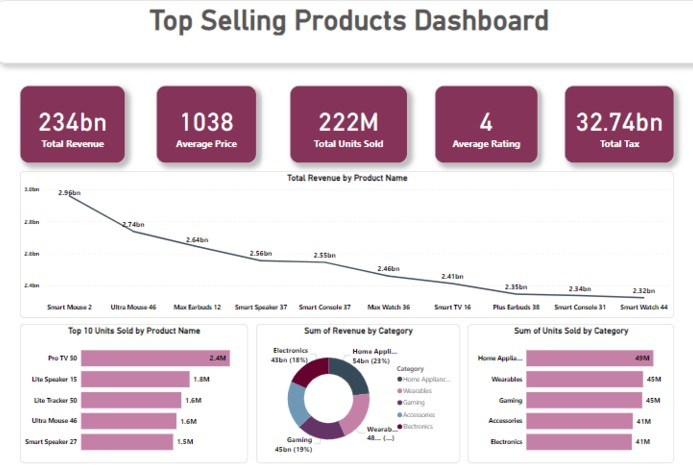

# 📊 Top Selling Products Dashboard

## 🚀 Overview  
This project presents an interactive **Power BI Dashboard** for analyzing top-selling products across different categories. The dashboard provides insights into revenue, units sold, and product performance trends.

## 🔍 Features
- ✅ **Product Performance Analysis** – Track top-selling products and units sold.
- ✅ **Category Breakdown** – Understand the sales contribution of different product categories.
- ✅ **Sales Trends** – Analyze revenue patterns over time.
- ✅ **Customer Ratings** – Identify high-rated products.
- ✅ **Interactive Data Exploration** – Filter data dynamically in Power BI.

## 📁 Dataset Information
The dataset consists of:
- **Product Name** – Names of the best-selling products.
- **Category** – Classification of products (Electronics, Home Appliances, etc.).
- **Year Released** – Year of product launch.
- **Price ($)** – Product price in USD.
- **Rating** – Average customer rating.
- **Units Sold** – Number of units sold.

## 📂 Folder Structure
```
/Sales-Dashboard-Project
│── /PowerBI_Files/               # Power BI (.pbix) files for dashboards  
│── /Images/                      # Screenshots of dashboards  
│── /Data/                        # Excel file with sales data  
│── README.md                     # Project documentation  
```

## 🛠️ Technologies Used
- **Power BI** – Interactive dashboard and data visualization.

## 🖼️ Dashboard Screenshot


## 💌 Contact
For any inquiries, feel free to reach out:  
📩 Email: aya.mohamedd1228@gmail.com 
👉 LinkedIn: [Aya Mohamed](https://www.linkedin.com/in/aya-mohamedd/)  

---
🌟 If you find this project useful, give it a ⭐ on GitHub!  

